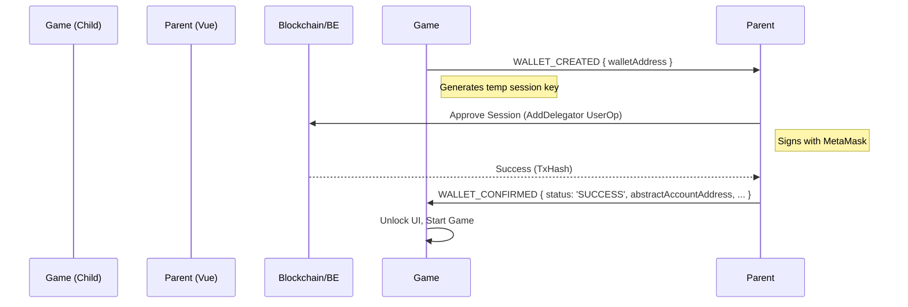

# Game Iframe Integration Guide

This guide details the integration between the Parent Application (Vue.js) and the Child Game Application (Next.js) embedded via an `iframe`. It covers the initialization process and the bidirectional communication flow using `EventBridge` (`postMessage`).

## 1. Iframe Embedding & Initialization

The interaction starts when the Parent App embeds the Game App.

### Process

1.  **Parent App**: Renders an `<iframe>` pointing to the Game App URL (`GAME_IFRAME_URL`).
2.  **Child App**: Loads, initializes its internal state, and waits for interaction.
3.  **Communication Init**: The Child App notifies the Parent when it is loaded.

### Code Implementation

**Parent App (`SessionKeyDemo.vue` / `GameIframe.vue`)**

The parent component uses a `GameIframe` wrapper to handle the embedding.

```html
<!-- SessionKeyDemo.vue -->
<game-iframe
  ref="gameIframe"
  :iframe-url="gameIframeUrl"
  @loaded="onIframeLoad"
  @wallet-created="handleWalletCreated"
  @game-result="handleGameResult"
  @game-logout="handleGameLogout"
/>
```

When the iframe loads, the Parent listens for the `load` event (or a specific ready message) and sends initial configuration, such as the "House" account address.

```javascript
// SessionKeyDemo.vue
onIframeLoad() {
  this.iframeLoaded = true
  
  // Send House Account config to the game immediately
  // Access the nested iframe element:
  // 1. this.$refs.gameIframe -> The Wrapper Component (<GameIframe>)
  // 2. .$refs.iframe -> The actual HTML <iframe> element inside it
  const iframe = this.$refs.gameIframe?.$refs?.iframe
  if (iframe) {
    eventBridge.sendToIframe(iframe, GameMessageType.HOUSE_CHANGED, {
      addressPaysReward: this.houseAccount.abstractAccount,
    })
  }
}
```

---

## 2. EventBridge Communication Flow

The applications communicate using a typed event system. Below are the key workflows.

### A. Session Wallet Creation (Game Start)

This flow authorizes a temporary "Session Key" generated by the game, allowing it to sign transactions on behalf of the user's smart account.

1.  **Child (Game)**: user clicks "Play". Game generates a random wallet (Session Key) and sends its address to Parent.
2.  **Parent**: Receives `WALLET_CREATED`. It uses the user's main wallet (e.g., MetaMask) to sign a UserOperation that "delegates" permission to this Session Key.
3.  **Parent**: Submits the Delegation UserOp to the backend.
4.  **Parent**: On success, sends `WALLET_CONFIRMED` back to the Child with the `AbstractAccount` address and configuration.
5.  **Child**: Receives confirmation and unlocks the game interface.

#### Flow Diagram



#### Code Examples

**1. Child Sends Request (`src/app/page.tsx`)**
```typescript
const handlePlayGame = async () => {
    // 1. Create random session wallet
    const randomWallet = ethers.Wallet.createRandom()
    setTempOwnerPk(randomWallet.privateKey)

    // 2. Send to Parent
    eventBridge.send(GameMessageType.WALLET_CREATED, { 
        walletAddress: randomWallet.address 
    })
    
    setIsWaitingForParent(true)
}
```

**2. Parent Handles Request (`SessionKeyDemo.vue`)**
```javascript
async handleWalletCreated(payload) {
    const gameAddress = payload.walletAddress
    
    // 1. Prepare UserOp to add delegate
    const userOp = await erc4337Service.createAddDelegatorUserOp({
        sessionAddress: gameAddress,
        // ... params ...
    })
    
    // 2. Sign & Submit
    const beResponse = await erc4337BackendService.submitUserOp({ userOp })
    
    // 3. Notify Child of success
    const iframe = this.$refs.gameIframe.$refs.iframe
    eventBridge.sendToIframe(iframe, GameMessageType.WALLET_CONFIRMED, {
        status: 'SUCCESS',
        abstractAccountAddress: this.abstractAccountAddress,
        tokenAddress: TOKEN_ADDRESS,
        tx: beResponse.txHash,
    })
}
```

### B. Game Play & Result Submission

When the user plays (rolls dice), the game logic happens in the Child, but results are communicated up to the Parent for history tracking and rewards.

1.  **Child**: User bets and rolls. Game determines win/loss.
2.  **Child**: Submits the result on-chain (using the confirmed Session Key).
3.  **Child**: Sends `GAME_PLAY_RESULT` to Parent.
4.  **Parent**: Updates UI history. If the user WON, the Parent triggers the "House" to pay the reward.

#### Code Examples

**1. Child Ends Round (`src/app/page.tsx`)**
```typescript
const handleRollDice = async (...) => {
    // ... calculate result ...
    const isWin = ...

    // 1. Submit UserOp (Background)
    await submitResultToBE(amount, isWin)

    // 2. Notify Parent
    eventBridge.send(GameMessageType.GAME_PLAY_RESULT, {
        isWin,
        diceValues,
        total,
        choice,
        winAmount,
    })
}
```

**2. Parent Processes Result (`SessionKeyDemo.vue`)**
```javascript
async handleGameResult(result) {
    // 1. Log to history
    this.$store.dispatch('sessionKey/addBetHistory', result)

    // 2. If Win, Pay Reward (House Action)
    if (result.isWin) {
        await this.processHouseReward(result)
    }
}
```

### C. Reward Payment

If the user wins, the Parent acts as the "House" (or calls the House service) to send tokens back to the user.

1.  **Parent**: Receives `GAME_PLAY_RESULT` (Win).
2.  **Parent**: Constructs a Transfer UserOp from the House Account to the User's Abstract Account.
3.  **Parent**: Submits to Backend.
4.  **Parent**: Sends `REWARD_SENT` to Child.
5.  **Child**: Updates balance display.

#### Code Examples

**1. Parent Pays (`SessionKeyDemo.vue`)**
```javascript
async processHouseReward(result) {
    // 1. Build Transfer UserOp (House -> User)
    const userOp = await erc4337Service.createTransferUserOp({
        sender: this.houseAccount.abstractAccount,
        recipient: this.abstractAccountAddress,
        amount: rewardAmount,
        // ...
    })
    
    // 2. Submit
    const rewardTx = await erc4337BackendService.submitUserOp({ userOp })

    // 3. Notify Child
    eventBridge.sendToIframe(iframe, GameMessageType.REWARD_SENT, {
        status: 'success',
        txHash: rewardTx.txHash,
        rewardAmount: rewardAmount,
    })
}
```

**2. Child Updates State (`src/app/page.tsx`)**
```typescript
eventBridge.listen(async (event) => {
    if (event.type === GameMessageType.REWARD_SENT) {
        const { status, rewardAmount } = event.value;
        if (status === 'success') {
             // Refresh balance from chain
             handleRefreshBalance()
        }
    }
})
```
